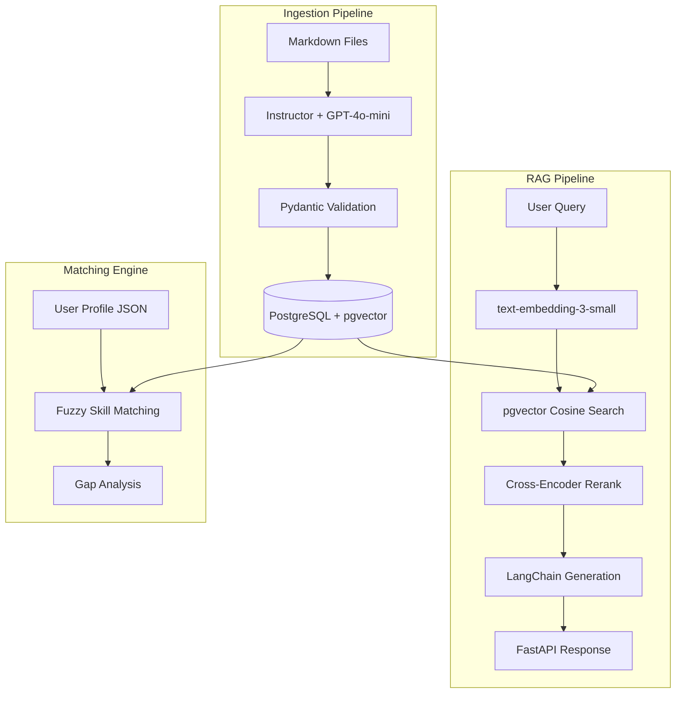

# Job RAG

RAG-powered system that ingests AI Engineer job postings, extracts structured skill data, matches against your profile, and surfaces insights for job applications.

## Architecture



## Features

- **Structured extraction** from 23+ job postings via GPT-4o-mini + Instructor with Pydantic validation
- **Semantic search** with pgvector cosine similarity + cross-encoder reranking
- **RAG answers** via LangChain generation chain with retrieved context
- **Skill matching** against user profile with fuzzy alias resolution
- **Gap analysis** aggregating missing skills across filtered postings
- **FastAPI async API** with 5 endpoints and Swagger docs
- **RAGAS evaluation** measuring faithfulness, answer relevancy, context precision
- **Dockerized deployment** via multi-stage build with Docker Compose
- **CI/CD** with GitHub Actions (lint, type check, test)

## Quick Start

### With Docker

```bash
# 1. Clone and configure
git clone https://github.com/your-username/job-rag.git
cd job-rag
cp .env.example .env
# Edit .env and add your OpenAI API key

# 2. Start the full system
docker compose up

# 3. Open the API docs
open http://localhost:8000/docs
```

### Local Development

```bash
# 1. Install dependencies
uv sync

# 2. Start just the database
docker compose up db -d

# 3. Initialize, ingest, and embed
job-rag init-db
job-rag ingest --show-cost
job-rag embed --show-cost

# 4. Start the API server
job-rag serve --reload
```

## API Endpoints

| Method | Endpoint | Description |
|--------|----------|-------------|
| GET | `/health` | Database connectivity check |
| GET | `/search?q=...&generate=true` | Semantic search with RAG-generated answer |
| GET | `/search?q=...&generate=false` | Semantic search returning ranked results |
| GET | `/match/{posting_id}` | Score user profile against a specific posting |
| GET | `/gaps?seniority=...&remote=...` | Aggregate skill gaps across filtered postings |
| POST | `/ingest` | Upload and process a new posting markdown file |

### Example Queries

```bash
# Semantic search with RAG answer
curl "http://localhost:8000/search?q=Which+jobs+require+LangChain"

# Skill gap analysis for remote senior roles
curl "http://localhost:8000/gaps?seniority=senior&remote=remote"
```

## How It Works

### 1. Ingestion

Markdown job postings are processed through GPT-4o-mini with Instructor for structured extraction. Each posting produces a `JobPosting` Pydantic model with title, company, requirements (categorized as must-have/nice-to-have), responsibilities, benefits, salary, and remote policy. Deduplication uses LinkedIn job ID + SHA-256 content hash.

### 2. Retrieval

User queries are embedded via `text-embedding-3-small` and matched against posting embeddings using pgvector cosine distance. Top results are reranked with a local cross-encoder model (`ms-marco-MiniLM-L-6-v2`). The reranked context is passed to a LangChain generation chain for natural language answers.

### 3. Matching

The user profile (`data/profile.json`) is compared against each posting's requirements using fuzzy skill matching with an alias dictionary (e.g., "PostgreSQL" matches "SQL", "React.js" matches "React"). The match score formula weights must-have skills at 70% and nice-to-have at 30%.

## Evaluation

RAG quality is measured using [RAGAS](https://docs.ragas.io/) against a golden dataset of 18 queries with manually verified ground truth answers.

| Metric | Score | Description |
|--------|-------|-------------|
| Faithfulness | 0.82 | Does the answer stay true to the retrieved context? |
| Answer Relevancy | 0.74 | Is the answer relevant to the question? |
| Context Precision | 0.60 | Are the retrieved documents relevant? |
| Context Recall | 0.47 | Are all relevant documents retrieved? |

*Evaluated on 18 golden queries across skill, filter, salary, comparative, and profile-relevant categories.*

Run evaluation locally:
```bash
uv run python scripts/evaluate.py
```

## Skills Demonstrated

| Skill | Implementation |
|-------|---------------|
| RAG + Vector DBs + Embeddings | pgvector similarity search, cross-encoder reranking, section-based chunking |
| Pydantic + Structured Outputs | Instructor extraction, Pydantic models for all data shapes, pydantic-settings |
| LangChain | RAG generation chain with `ChatPromptTemplate`, `ChatOpenAI`, `StrOutputParser` |
| FastAPI | Async API with dependency injection, lifespan management, 5 endpoints |
| Production Python | Type hints throughout, structlog, async/await, Typer CLI, tenacity retry |
| PostgreSQL + pgvector | Schema design with UUIDs, indexes, separate requirements table, vector columns |
| Docker | Multi-stage Dockerfile with CPU-only PyTorch, Docker Compose orchestration |
| CI/CD | GitHub Actions: ruff lint, pyright type check, pytest |
| Evaluation (RAGAS) | Golden dataset, faithfulness/relevancy/precision/recall metrics |
| Testing | 48+ unit tests, extraction accuracy tests, mocked dependencies |

## Design Decisions

**pgvector over dedicated vector DB (Pinecone, Weaviate):** Leverages existing PostgreSQL skills, keeps the stack simple, avoids vendor lock-in. Structured data and vectors live in the same database.

**Cross-encoder reranking:** Two-stage retrieval (fast vector search → precise reranking) gives better precision than vector search alone. The cross-encoder runs locally (~80MB model, no API cost).

**Section-based chunking over fixed-size:** Postings are split into semantic sections (responsibilities, must_have, nice_to_have, benefits) rather than arbitrary character windows. This preserves context boundaries.

**Sync + async dual engine:** CLI commands use sync SQLAlchemy (simple, no event loop needed). FastAPI uses async for concurrent request handling. Both share the same ORM models.

**LangChain only for generation:** Retrieval uses direct SQLAlchemy + pgvector queries (no duplicate vector store). LangChain adds value in the generation step with prompt templates and model abstraction.

**CPU-only PyTorch in Docker:** Reduces image size by ~1.5GB. The cross-encoder model runs fine on CPU for the reranking workload.

## Project Structure

```
job-rag/
├── src/job_rag/
│   ├── cli.py                    # Typer CLI (init-db, ingest, embed, serve, etc.)
│   ├── config.py                 # pydantic-settings configuration
│   ├── models.py                 # Pydantic domain models and enums
│   ├── logging.py                # structlog setup
│   ├── db/
│   │   ├── engine.py             # SQLAlchemy sync + async engines
│   │   └── models.py             # ORM models (JobPosting, JobRequirement, JobChunk)
│   ├── extraction/
│   │   ├── extractor.py          # Instructor + GPT-4o-mini extraction
│   │   └── prompt.py             # System prompt with mapping rules
│   ├── services/
│   │   ├── ingestion.py          # File ingestion with deduplication
│   │   ├── embedding.py          # OpenAI batch embedding
│   │   ├── retrieval.py          # pgvector search, reranking, RAG generation
│   │   └── matching.py           # Profile matching and gap analysis
│   └── api/
│       ├── app.py                # FastAPI app with lifespan
│       ├── deps.py               # Async session dependency
│       └── routes.py             # API endpoints
├── tests/                        # 48+ tests (models, extraction, matching, retrieval, API)
├── data/
│   ├── postings/                 # 23 job posting markdown files
│   ├── profile.json              # User skill profile
│   └── eval/                     # Golden dataset and RAGAS results
├── scripts/
│   ├── evaluate.py               # RAGAS evaluation script
│   └── docker-entrypoint.sh      # Docker startup script
├── Dockerfile                    # Multi-stage build
├── docker-compose.yml            # PostgreSQL + FastAPI app
└── .github/workflows/ci.yml     # CI/CD pipeline
```

## Cost

Total cost to process 23 postings: **~$0.03** (extraction $0.025 + embeddings $0.0002).
