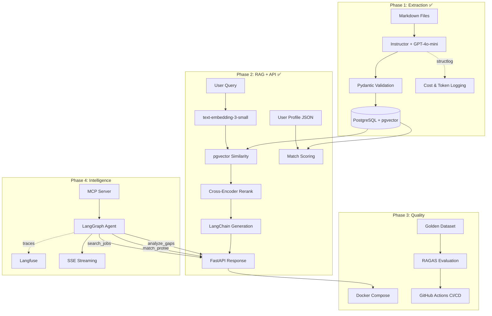

# Job Posting RAG System — Project Plan

**Purpose:** RAG-powered tool that ingests AI Engineer job postings, extracts structured skill data, matches against my profile, and surfaces insights for job applications.

**Status:** Phase 3 Complete — Phase 4 Next

**Created:** 2026-04-06
**Last updated:** 2026-04-08

---

## Why This Project

- Solves a real problem during my AI Engineer career pivot
- Closes skill gaps 1-4, 6 from my requirements doc in a single project
- Portfolio piece that stands out (real use case, not "chat with PDFs")
- Uses pgvector (leverages existing PostgreSQL experience from RelationshipApp)

---

## Skills Closed Per Phase

| Skill | Gap # | Phase |
|---|---|---|
| Pydantic + Structured Outputs (Instructor) | 2 | 1 ✅ |
| Production Python (type hints, structlog, CLI) | — | 1 ✅ |
| pgvector setup + schema design | 1 | 1 ✅ |
| RAG + Vector DBs + Embeddings | 1 | 2 ✅ |
| LangChain | 3 | 2 ✅ |
| FastAPI | 4 | 2 ✅ |
| Evaluation frameworks (RAGAS) | 6 | 3 ✅ |
| Docker deployment (FastAPI + DB) | — | 3 ✅ |
| CI/CD (GitHub Actions) | 13 | 3 ✅ |
| LangGraph (agent orchestration) | 3 | 4 |
| MCP server development | 5 | 4 |
| LLM observability (Langfuse) | 7 | 4 |
| Streaming responses (SSE) | 9 | 4 |
| Tool use / function calling | 10 | 4 |

---

## Tech Stack

| Tool | Purpose | Phase |
|---|---|---|
| Python 3.12+ | Core language | All |
| Pydantic + Instructor | Structured extraction from LLMs | 1 ✅ |
| PostgreSQL + pgvector | Storage + vector search | All |
| SQLAlchemy 2.0 | ORM (sync P1, async P2+) | All |
| OpenAI gpt-4o-mini | Extraction (cheap, fast) | 1 ✅ |
| OpenAI text-embedding-3-small | Semantic embeddings (1536 dims) | 2 ✅ |
| LangChain | RAG retrieval pipeline | 2 ✅ |
| FastAPI | REST API | 2 ✅ |
| Cross-encoder reranker | Retrieval precision | 2 ✅ |
| RAGAS | RAG evaluation metrics | 3 ✅ |
| Docker Compose | Containerized deployment | 3 ✅ |
| GitHub Actions | CI/CD (lint, test, type check) | 3 ✅ |
| LangGraph | Agent orchestration | 4 |
| Custom MCP Server | Expose system to Claude Code | 4 |
| Langfuse | LLM observability/tracing | 4 |
| SSE | Streaming responses | 4 |
| Typer | CLI framework | 1 ✅ |
| structlog | Structured logging | 1 ✅ |
| pytest | Testing | All |

---

## Architecture

---

## Phase 1 — Structured Extraction & Storage ✅

**Goal:** Run `job-rag ingest` and have all postings extracted into structured data in PostgreSQL.

**Skills closed:** Production Python, Pydantic + structured outputs, pgvector, structured logging.

### What Was Built

| File | Purpose |
|---|---|
| `src/job_rag/models.py` | Pydantic models: JobPosting, JobRequirement, UserSkillProfile, enums (SkillCategory, RemotePolicy, Seniority, SalaryPeriod) |
| `src/job_rag/config.py` | pydantic-settings BaseSettings loading from .env |
| `src/job_rag/logging.py` | structlog configuration with ISO timestamps |
| `src/job_rag/db/engine.py` | Sync SQLAlchemy engine, SessionLocal, Base, init_db() |
| `src/job_rag/db/models.py` | ORM models: JobPostingDB (UUID PK, linkedin_job_id unique, content_hash, embedding Vector(1536) nullable, prompt_version) + JobRequirementDB (skill, category, required, FK cascade) |
| `src/job_rag/extraction/prompt.py` | System prompt v1.0 with mapping rules for remote policy, seniority, salary, skill categorization |
| `src/job_rag/extraction/extractor.py` | Instructor extraction with tenacity retry (3 attempts, exponential backoff), cost tracking per call |
| `src/job_rag/services/ingestion.py` | Batch ingestion: read markdown → check dedup (linkedin_job_id + content_hash) → extract → store |
| `src/job_rag/cli.py` | Typer CLI: init-db, ingest (--show-cost), list (--company filter), stats |
| `tests/test_models.py` | 13 tests — Pydantic validation, enum values, helper functions |
| `tests/test_extraction.py` | 7 tests — mocked Instructor extraction, post-processing |

### Key Design Decisions

- **Deduplication:** linkedin_job_id from URL (primary) + SHA-256 content_hash (secondary)
- **Salary normalization:** LLM classifies period (hour/month/year), Python converts to EUR/year. Raw string preserved in `salary_raw`
- **Separate requirements table:** Not JSONB — enables SQL queries like "which jobs need LangChain?"
- **Embedding column added now (nullable):** Populated in Phase 2, zero cost when NULL
- **Prompt versioning:** `prompt_version` stored per extraction for future A/B comparison
- **Cost tracking:** Each extraction logs tokens + USD cost; `--show-cost` flag on CLI

### Results

- **23/23 postings ingested** — $0.025 total cost
- **359 requirements extracted** across 8 categories
- **Dedup verified** — re-run: 0 ingested, 23 skipped
- **20/20 tests passing**, ruff clean, pyright clean
- **Top skills found:** Python (19x), LangChain (6x), ML (5x), PyTorch (5x), RAG (4x), Docker (3x), FastAPI (3x)

---

## Phase 2 — RAG Core + FastAPI ✅

**Goal:** Semantic search over job postings via API. Skill matching against user profile.

**Skills closed:** RAG architecture, embeddings, LangChain, FastAPI.

### What Was Built

| File | Purpose |
|---|---|
| `src/job_rag/db/engine.py` | Added async engine (asyncpg) + AsyncSessionLocal alongside existing sync engine |
| `src/job_rag/db/models.py` | Added JobChunkDB (section-based chunks with Vector(1536) embeddings) |
| `src/job_rag/services/embedding.py` | OpenAI batch embedding, section-based chunking, format_posting_for_embedding() |
| `src/job_rag/services/retrieval.py` | pgvector cosine search, cross-encoder reranking, LangChain RAG generation chain |
| `src/job_rag/services/matching.py` | Profile loading, fuzzy skill matching with aliases, scoring formula, gap aggregation |
| `src/job_rag/api/app.py` | FastAPI app with async lifespan |
| `src/job_rag/api/deps.py` | Async session dependency injection |
| `src/job_rag/api/routes.py` | 5 endpoints: /health, /search, /match/{id}, /gaps, /ingest |
| `src/job_rag/cli.py` | Added `embed` (populate embeddings) and `serve` (start uvicorn) commands |
| `data/profile.json` | User skill profile (30 skills from requirements doc) |
| `tests/test_matching.py` | 15 tests — skill normalization, matching, scoring formula, gap aggregation |
| `tests/test_retrieval.py` | 4 tests — reranking with mocked cross-encoder |
| `tests/test_api.py` | 5 tests — all endpoints with mocked dependencies |

### Key Design Decisions

- **Dual engine:** Sync SQLAlchemy for CLI, async for FastAPI — no breaking changes to Phase 1
- **SQLAlchemy + pgvector for retrieval, LangChain only for generation:** Avoids duplicate vector store, uses existing schema
- **Section-based chunking:** Splits postings into responsibilities, must_have, nice_to_have, benefits sections
- **Cross-encoder reranker:** `cross-encoder/ms-marco-MiniLM-L-6-v2` runs locally (~80MB, no API cost)
- **Fuzzy skill matching:** Alias dictionary maps variations (e.g., "PostgreSQL" → "sql", "React.js" → "react")
- **Match formula:** `score = (matched_must / total_must) * 0.7 + (matched_nice / total_nice) * 0.3`

### Results

- **23/23 postings embedded** — 74 chunks total, $0.000168 embedding cost
- **Full RAG pipeline verified** — search → rerank → LangChain generation working end-to-end
- **48/48 tests passing**, ruff clean, pyright clean
- **Top skill gaps identified:** ML (17.4%), LangChain (13%), RAG (13%), FastAPI (13%)
- **API live at** `localhost:8000` with Swagger docs at `/docs`

---

## Phase 3 — Evaluation + Docker Deployment

**Goal:** Prove it works with metrics. Make it portable. CI/CD.

**Skills to close:** Evaluation frameworks (RAGAS), containerized deployment, CI/CD.

### Evaluation

- [x] Create golden evaluation dataset: `data/eval/golden_queries.json` with 18 queries and expected results
- [x] RAGAS evaluation script: `scripts/evaluate.py` (faithfulness, answer relevancy, context precision, context recall)
- [x] Pytest test suite for extraction accuracy: `tests/test_extraction_accuracy.py` (5 postings, 10 parametrized test categories)

### Docker

- [x] Multi-stage Dockerfile for FastAPI app (uv + CPU-only PyTorch → slim runtime)
- [x] Update `docker-compose.yml`: `app` service with healthcheck, env overrides, depends_on
- [x] `docker compose up` runs the full system (init-db → ingest → embed → serve)

### CI/CD

- [x] GitHub Actions workflow (`.github/workflows/ci.yml`): ruff, pyright, pytest

### README as Portfolio Showcase

- [x] Architecture diagram (Mermaid)
- [x] "Skills demonstrated" section mapping to 10 target skills
- [x] Setup instructions (Docker + local dev paths)
- [x] Design decisions section
- [x] API endpoints documentation
- [ ] Demo GIF (stretch goal)

**Done when:** `docker compose up` runs the full system. RAGAS metrics documented. CI passes on push.

---

## Phase 4 — Agent Layer + MCP + Observability

**Goal:** Make it smart, autonomous, and observable.

**Skills to close:** LangGraph, MCP development, Langfuse observability, SSE streaming, tool use.

### LangGraph Agent (scoped to 3 tools)

- [ ] `search_jobs(query, filters)` → semantic search
- [ ] `match_profile(posting_id)` → skill match against user profile
- [ ] `analyze_gaps(filters)` → aggregate gap analysis

Stretch goals: auto-process folder, CV bullet point generation, high-match alerts.

### MCP Server

- [ ] `search_postings(query, remote_only)` → list of matching postings
- [ ] `match_skills(posting_id)` → match report
- [ ] `skill_gaps(seniority)` → aggregated gaps
- [ ] `ingest_posting(file_path)` → add new posting

### Observability

- [ ] Langfuse integration: trace every LLM call, token usage, latency, cost
- [ ] Dashboard showing extraction costs, retrieval performance, query patterns

### Streaming

- [ ] SSE endpoint for chat-style interface
- [ ] Real-time streaming of RAG responses

### New Dependencies

langgraph, mcp, langfuse, sse-starlette

**Done when:** Can drop a new posting file, have it auto-processed, query it from Claude Code via MCP, see full traces in Langfuse, and get streaming responses.

---

## Queries the System Should Handle

- "Which postings value MCP experience?"
- "Find roles where my automotive HMI background is a differentiator"
- "What are the top 5 skills I'm missing across all senior AI Engineer postings?"
- "Generate tailored bullet points for this Anthropic posting"
- "Show me remote-friendly roles with >80% skill match"
- "What salary range do postings matching my profile offer?"

---

## Success Metrics

- Retrieval precision: relevant postings returned for skill-based queries
- Extraction accuracy: structured data correctly parsed from raw postings
- Match score correlation: system scores align with manual assessment
- Time saved: faster than manually reading and comparing postings
- Portfolio signal: deployed, documented, measurable
- RAGAS scores: faithfulness > 0.8, answer relevancy > 0.8
